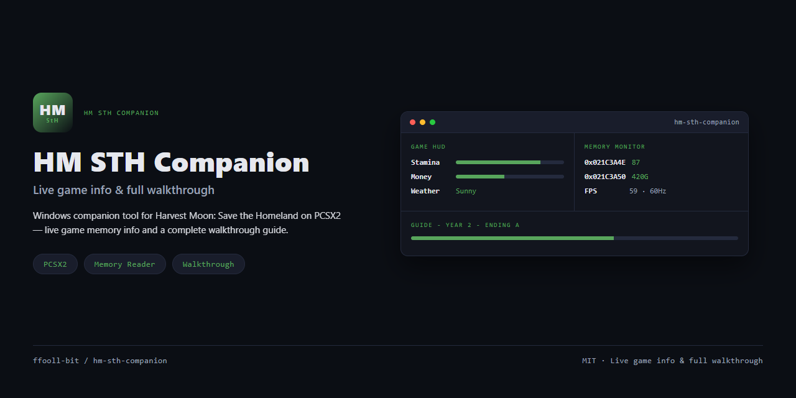

<div align="center">

<h1>HM STH Companion</h1>



A Windows desktop companion app — live game info & full walkthrough for **Harvest Moon: Save the Homeland** on PCSX2.

[](https://github.com/ffooll-bit/hm-sth-companion/actions/workflows/ci.yml)
[](LICENSE)

</div>

## Features (planned)

- Live memory reading from the PCSX2 process using known pointer addresses.
- Real-time display of game state relevant to the player.
- A built-in, complete game guide covering all years and endings.

> The project is in early bootstrap; no release exists yet.

## Requirements

- Windows 10/11 (x64).
- .NET 8 SDK.
- PCSX2 emulator running Harvest Moon: Save the Homeland with PINE IPC enabled (Settings → PINE IPC, TCP `127.0.0.1:28011`).

## Quick start

Enable PINE IPC in PCSX2 settings, then run the proof of concept:

```bash
dotnet run --project src/HmSth.Poc
```

Expected output on success (exit code 0):

```
Emulator version: 2.0.2
Game title: Harvest Moon: Save the Homeland
Game serial: SLUS-20251
Memory read at 0x00200000: 0x00000000
```

Exit codes:
- `0` — Game detected and memory read succeeded
- `1` — Cannot connect to PCSX2 (PINE IPC not enabled or wrong port)
- `2` — Connected but wrong game (serial mismatch)

## Development

See [CONTRIBUTING.md](CONTRIBUTING.md) for the development workflow, commit style, and pull request rules.

See [CHANGELOG.md](CHANGELOG.md) for release history.

See [CODE_OF_CONDUCT.md](CODE_OF_CONDUCT.md) for community standards.

See [SECURITY.md](SECURITY.md) for the security policy.

## License

Distributed under the [MIT License](LICENSE).
